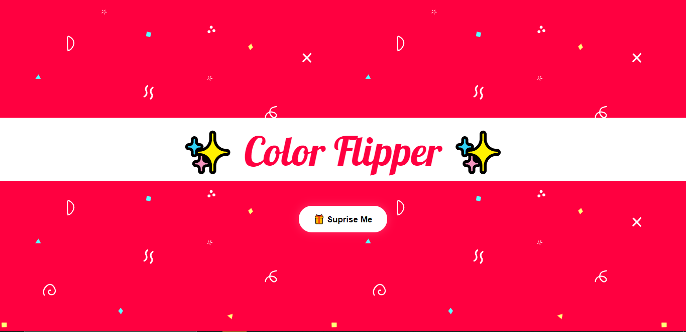
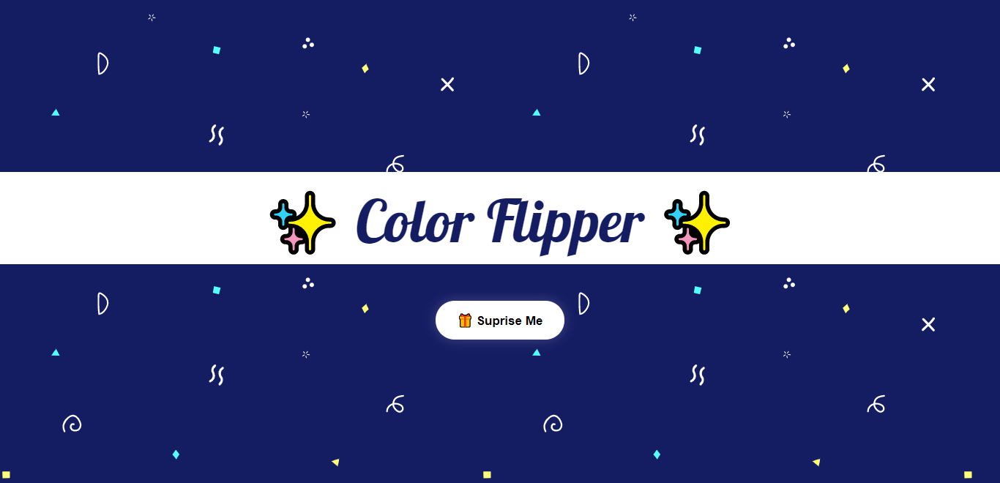
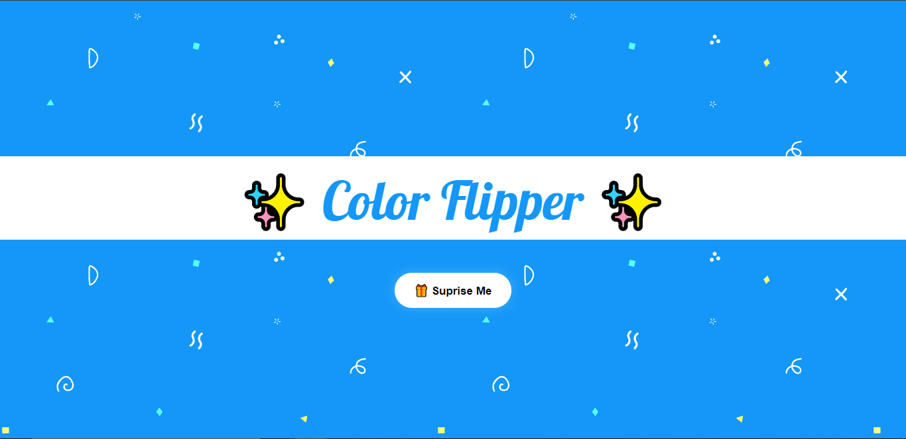

## Color Flipper ✨

Simple and Beautiful App that changes the background color of an image when clicking a button. It helps you understand how javascript can change a style in css.

### Screenshots 📷





## Get Started 🦄
* Play Around the Website [link here](https://joloutherookie.github.io/ColorFlipper/)
* If you want Clone the Repository
```
https://github.com/JolouTheRookie/ColorFlipper.git
```
* Study and Analyze the Code
* Change or Improve the Code

## Resources 📚
* Idea of this Project - [JS Projects || John Smilga](https://www.vanillajavascriptprojects.com/)
* Design of the Background - [SVG Backgrounds](https://www.svgbackgrounds.com/)
* "Color Flipper" Lobster Font Style - [Google Fonts](https://fonts.google.com/)
* For Emojis Design - [Emojipedia](https://emojipedia.org/)

## Contribution 🔥
If you want to contribute to this project and make it better, then fork this repo and your very own pull request is welcome. If you find some problem to this project then just put it in the issue page. Thank you 😊

## Thank you 😃
If you like this project just click ⭐ and share it with others.


